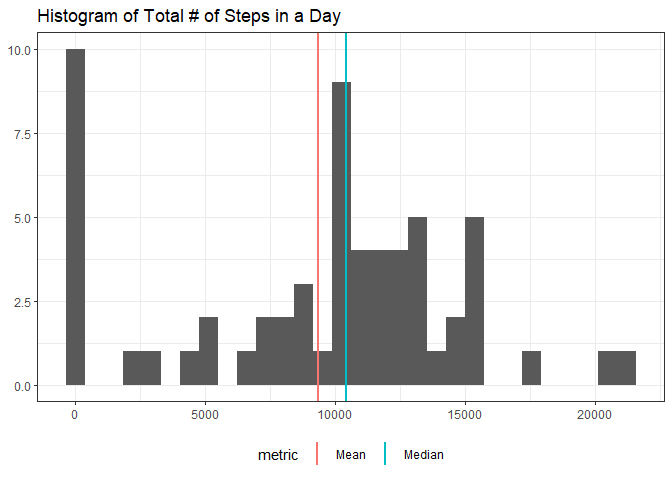
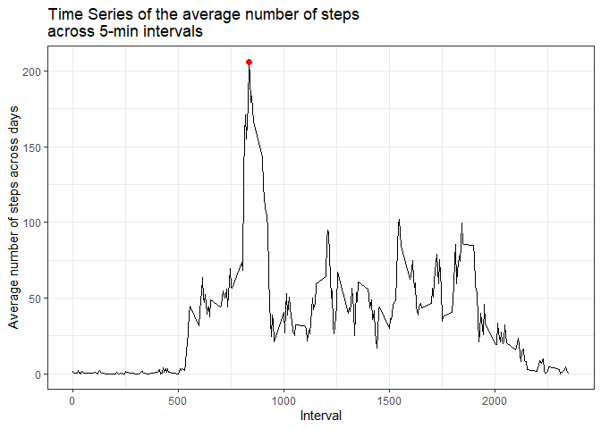

## Loading and preprocessing the data


```r
# Load the necessary libraries for analysis
library(dplyr)
library(ggplot2)
library(skimr)
library(tidyr)
```

We'll start by unzipping and loading the data. If the data is already unzipped it is just loaded.


```r
if (!file.exists("activity.csv")) {
  
  unzip("activity.zip")
  
}

df <- read.csv("activity.csv")
```


## What is mean total number of steps taken per day?

For this part, we are ignoring the missing values in the dataset. Below is a histogram of the total number of steps taken every day.


```r
steps <- df %>% 
  group_by(date) %>% 
  summarise(total_steps = sum(steps, na.rm = TRUE), .groups = "drop")

summary <- steps %>% 
  summarise(Mean = mean(total_steps), Median = median(total_steps)) %>% 
  pivot_longer(cols = everything(), names_to = "metric", values_to = "value")

hist <- ggplot(steps, aes(total_steps)) + 
  geom_histogram() + 
  geom_vline(data = summary, mapping = aes(xintercept = value, color = metric), size = 1, show.legend = TRUE) + 
  theme_bw() + 
  theme(legend.position = "bottom") + 
  xlab(NULL) + 
  ylab(NULL) + 
  ggtitle("Histogram of Total # of Steps in a Day")
  
hist
```

```
## `stat_bin()` using `bins = 30`. Pick better value with `binwidth`.
```

<!-- -->

The mean and median of the total number of steps in a day is shown in the table below:


```r
summary
```

```
## # A tibble: 2 x 2
##   metric  value
##   <chr>   <dbl>
## 1 Mean    9354.
## 2 Median 10395
```

## What is the average daily activity pattern?

We plot the average number of steps for each 5-minute interval across all days.


```r
interval_mean <- df %>% 
  group_by(interval) %>% 
  summarise(mean_steps = mean(steps, na.rm = TRUE), .groups = "drop")

max_interval_mean <- interval_mean %>% 
  filter(mean_steps == max(mean_steps)) %>% 
  separate(interval, sep = -2, into = c("hour", "minute"), remove = FALSE)

ts <- ggplot(interval_mean, aes(interval, mean_steps)) + 
  geom_line() + 
  geom_point(data = max_interval_mean, size = 2, colour = "red") + 
  theme_bw() + 
  xlab("Interval") + 
  ylab("Average number of steps across days") + 
  ggtitle("Time Series of the average number of steps \nacross 5-min intervals")

ts
```

<!-- -->

The maximum number of average steps across all days and intervals is , which happened at 8 hours and 35 minutes.

## Imputing missing values


## Are there differences in activity patterns between weekdays and weekends?
